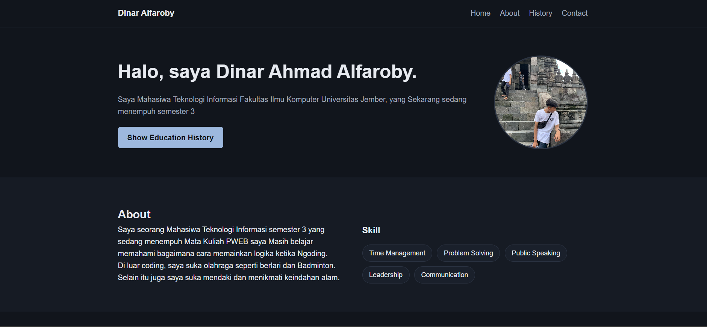
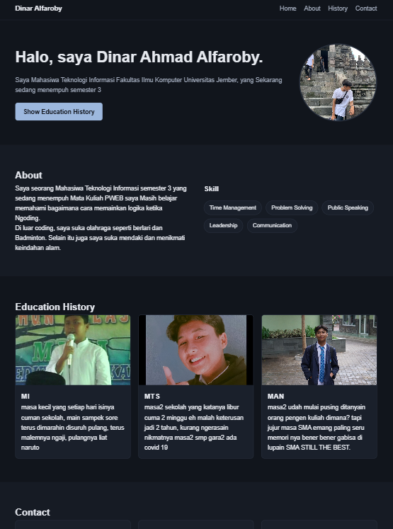
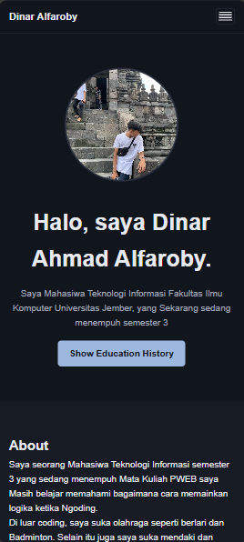

# 🌐 Web Portofolio - Dinar Ahmad Alfaroby
Selamat datang di repositori web portofolio pribadi saya! Website ini dibuat sebagai proyek portofolio interaktif sekaligus media perkenalan rekam jejak pendidikan, keahlian, dan hobi saya.

## 📌 Tentang Website

Website ini berisikan informasi pribadi mengenai latar belakang saya sebagai mahasiswa **Teknologi Informasi**, keahlian (*skills*), hobi, serta rekam jejak pendidikan dari tingkat dasar hingga menengah atas.

* **Nama:** Dinar Ahmad Alfaroby
* **Status:** Mahasiswa Teknologi Informasi (Semester 3)
* **Fakultas:** Ilmu Komputer, Universitas Jember

## ✨ Fitur Utama

- 📱 **Desain Responsif:** Tampilan menyesuaikan dengan optimal di berbagai perangkat (Desktop, Tablet, dan Smartphone).
- 🍔 **Menu Hamburger Mobile:** Navigasi interaktif yang ramah pengguna untuk layar berukuran kecil.
- 🎨 **Tema Dark Mode:** Tampilan visual bernuansa gelap (*dark theme*) yang nyaman di mata.
- 🕒 **Tahun Otomatis:** Bagian footer yang memperbarui tahun hak cipta secara otomatis menggunakan JavaScript.


## 🛠️ Teknologi yang Digunakan

- **HTML5:** Struktur utama konten website.
- **CSS3:** Penataan gaya (*styling*), layout Flexbox, dan *responsive design* (*media queries*).
- **JavaScript (Vanilla):** Manipulasi DOM untuk navigasi menu mobile dan logika tahun footer.

## 📁 Struktur Folder

```text
.
├── asset/
│   ├── Guwa.jpg          # Foto profil hero section
│   ├── akukecil.jpg      # Foto rekam jejak MI
│   ├── akusmp.jpg        # Foto rekam jejak MTS
│   └── akuman.JPG        # Foto rekam jejak MAN
├── index.html            # File HTML utama
├── style.css             # File styling CSS
├── script.js             # File logika JavaScript
└── README.md             # Dokumentasi proyek
```

**SS AN**

DESKTOP 


**TABLET** 


**MOBILE** 

